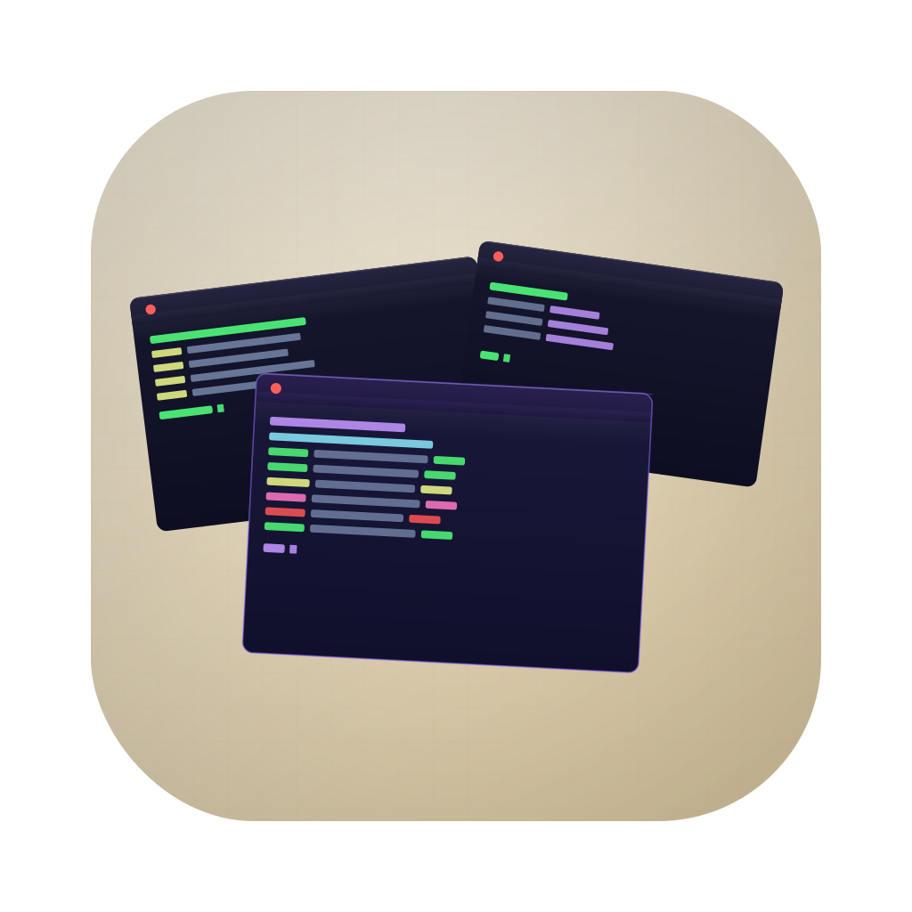

# Mosaic

An infinite 2D spatial canvas for macOS where real PTY-backed terminal windows can be freely panned, zoomed, dragged, and resized. Think of it as a whiteboard where every sticky note is a live shell.

 



<video src="docs/smaller.mov" controls width="100%"></video>

## What it does

- **Infinite canvas** — pan with two-finger scroll, zoom with pinch or scroll wheel, zoom anchored to cursor position
- **Real terminals** — each window is a live PTY running your shell
- **Freeform layout** — drag windows by their title bar, resize from any edge or corner
- **Annotations** — text labels, sticky notes, arrows, freehand drawing, and images directly on the canvas
- **Minimap** — always-visible overview in the corner; click or drag to jump
- **Broadcast mode** — fan keystrokes out to all terminal windows simultaneously
- **Themes** — built-in themes plus a full SwiftUI theme editor with export/import
- **Workspace persistence** — layout, annotations, and scrollback history restored across launches

## Requirements

- macOS 14 (Sonoma) or later
- Xcode 15 or later
- [xcodegen](https://github.com/yonaskolb/XcodeGen): `brew install xcodegen`

## Building

```bash
xcodegen generate
open Mosaic.xcodeproj
# Cmd+R to run
```

On first build, Xcode resolves the SwiftTerm SPM dependency automatically.

## Running tests

```bash
xcodegen generate
xcodebuild test -scheme MosaicTests -destination 'platform=macOS'
```

## Keyboard shortcuts

| Key | Action |
|-----|--------|
| `V` | Pointer tool |
| `T` | Terminal placement tool (click canvas to spawn) |
| `L` | Text label |
| `N` | Sticky note |
| `A` | Arrow |
| `P` | Pen / freehand |
| `I` | Insert image |
| `X` | Delete tool (click or drag a selection box) |
| `Cmd+T` | New terminal (at default position) |
| `Cmd+S` | Save workspace |
| `Cmd+0` | Reset zoom to 100% |
| `Cmd+F` | Fit all terminals in view |
| `Cmd+Shift+B` | Toggle broadcast mode |
| Double-click canvas | Spawn terminal at cursor |
| Right-click annotation | Delete |
| `Cmd`+scroll | Force pan (overrides terminal scroll) |

## Architecture

```
┌─────────────────────────────────────────────────────────┐
│  AppDelegate                                            │
│  └─ CanvasViewController (coordinator)                  │
│      ├─ CanvasView ──────── worldView (FlippedView)     │
│      │   └─ bounds transform   ├─ TerminalWindowView(s) │
│      │      (pan/zoom)         └─ AnnotationView(s)     │
│      ├─ MinimapView (CVDisplayLink, ~60fps)             │
│      ├─ ToolPaletteView (SwiftUI HUD)                   │
│      └─ ThemeEditorViewController (SwiftUI panel)       │
│                                                         │
│  WorkspaceStore ──► ~/Library/Application Support/      │
│                      Mosaic/workspace.json              │
│                      Mosaic/Images/<uuid>.png           │
└─────────────────────────────────────────────────────────┘
```

Pure Swift + AppKit + [SwiftTerm](https://github.com/migueldeicaza/SwiftTerm). No Electron, no web runtime. SwiftUI is used for floating panels and HUDs where it adds value without complicating world-space coordinate math.

See `Docs/ADR/` for detailed rationale behind key decisions.

## Project layout

```
Mosaic/
├── App/              # AppDelegate, menu bar
├── Canvas/           # CanvasView, CanvasViewController, CanvasGeometry, FlippedView
├── Terminal/         # TerminalWindowView, TitleBarView, ResizeHandleView, TerminalManager
├── Annotations/      # AnnotationView subclasses, ToolPaletteView, CanvasTool
├── Minimap/          # MinimapView
├── Theming/          # Theme, ThemeEditorViewController (SwiftUI)
├── Persistence/      # WorkspaceSnapshot (Codable), WorkspaceStore
└── Utilities/        # Extensions (Comparable.clamped, CGRect center init)

Tests/                # Unit tests (MosaicTests target)
Docs/ADR/             # Architecture Decision Records
```

## Persistence

- **Workspace** auto-saves to `~/Library/Application Support/Mosaic/workspace.json` on a 5-second debounce; flushed synchronously on quit.
- **Terminal scrollback** (up to 300 lines) is saved as plain text and restored dim/italic on next launch.
- **Image annotations** are saved as PNGs in `~/Library/Application Support/Mosaic/Images/`.
- Terminal PTY processes are always fresh on launch — only the working directory is restored.

## License

MIT
